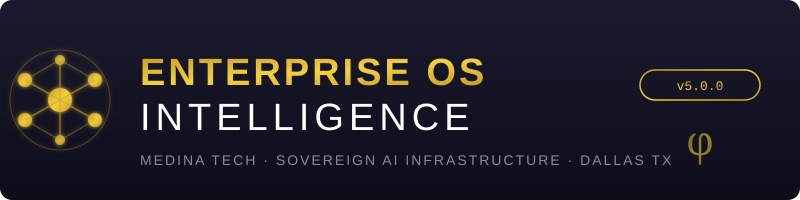

<div align="center">

<picture>
  <source media="(prefers-color-scheme: dark)" srcset=".github/logo.svg">
  <source media="(prefers-color-scheme: light)" srcset=".github/logo.svg">
  
</picture>

<br><br>

**Sovereign AI infrastructure for enterprises, institutions, and individuals.**<br>
*Built by Alfredo Medina Hernandez · Medina Tech · Dallas, Texas*

<br>

<!-- Status Badges -->
[](https://github.com/FreddyCreates/Enterprise-OS-intelligence/actions/workflows/deploy-pages.yml)
[](https://github.com/FreddyCreates/Enterprise-OS-intelligence/actions/workflows/deploy-workers.yml)
[](https://github.com/FreddyCreates/Enterprise-OS-intelligence/actions/workflows/oro-ci.yml)
[](https://github.com/FreddyCreates/Enterprise-OS-intelligence/actions/workflows/julia-ci.yml)
[](https://github.com/FreddyCreates/Enterprise-OS-intelligence/actions/workflows/sdk-release.yml)
[](https://github.com/FreddyCreates/Enterprise-OS-intelligence/actions/workflows/security-intelligence.yml)

<!-- Info Badges -->
[](LICENSE)
[](papers/)
[](sdk/)
[](production-apps/)
[](charters/)
[](cloudflare-workers/)
[](papers/)

<!-- Tech Badges -->
[](https://internetcomputer.org)
[](https://workers.cloudflare.com)
[](https://nodejs.org)
[](go/)
[](rust/)
[](julia/)
[](python/)
[](src/)

<br>

[**Install CLI →**](#-install) · [**Products →**](#-products--interfaces) · [**For Developers →**](#-for-developers) · [**Research →**](#-research-papers) · [**Architecture →**](#-how-it-works)

</div>

<br>

---

## 🧬 What Is This?

**Enterprise OS Intelligence** is a complete sovereign AI platform — not a library, not a framework, but a full operating intelligence layer that runs your business, protects your data, and compounds knowledge over time.

Think of it like an **operating system for intelligence itself**. It connects your tools, automates your workflows, protects your infrastructure, and learns — permanently. No third-party AI has access to your data. Everything runs on infrastructure you control.

### Who Is This For?

| You are... | What you get |
|:---|:---|
| 🏢 **A business owner** | AI that connects all your systems (SAP, Salesforce, Oracle, etc.) into one intelligent layer. One command. No consultants. |
| 👷 **An operator** | Real-time infrastructure monitoring, intelligent caching, zero-downtime deployment, threat detection |
| 📋 **A project manager** | Workforce intelligence, automated billing, supply chain optimization — all in plain language |
| 👨‍⚖️ **A legal professional** | AI contract analysis, risk scoring, redline drafting — no subscription service |
| 🎓 **A student** | Free AI tutoring, study tools, quiz generation — the Bronze Canister program |
| 👨‍💻 **A developer** | 139 SDKs, multi-language support, instant scaffolding, production-ready templates |
| 🏥 **A hospital/institution** | Sovereign intelligence organisms — your data stays yours, always |

---

## ⚡ Install

Get the full CLI in one command. No prerequisites except Node.js 18+.

### Windows (PowerShell)

```powershell
irm https://freddycreates.github.io/Enterprise-OS-intelligence/install.ps1 | iex
```

### macOS / Linux

```bash
curl -fsSL https://freddycreates.github.io/Enterprise-OS-intelligence/install.sh | sh
```

### Then run:

```bash
rship                     # Interactive dashboard
rship status              # System health
rship apps                # Browse 35+ production apps
rship intel               # Intelligence console
rship deploy [target]     # Deploy to production
```

### Operating Modes

| Mode | Command | Best For |
|:---|:---|:---|
| **Enterprise** | `rship --mode enterprise` | Business owners — full suite: billing, workforce, supply chain |
| **Developer** | `rship --mode developer` | Engineers — SDKs, hot-reload, deployment pipelines |
| **Operator** | `rship --mode operator` | IT/Ops — infrastructure monitoring, cache control, security |
| **Sovereign** | `rship --mode sovereign` | Air-gapped environments — zero external dependencies |

---

## 📦 Products & Interfaces

These are real, working applications. Not prototypes — production systems.

### For Everyone

| Product | What It Does | How to Use |
|:---|:---|:---|
| **EffectTrace** | Governance intelligence dashboard — see what proposals actually change | [Web App](dist/pages/emailai-app.html) |
| **EmailAI Mesh** | Intelligent email processing and automation | [Dashboard](dist/pages/emailai-mesh.html) |
| **NOVA Security** | AI threat detection that learns attacker patterns in real-time | [Console](dist/pages/nova.html) |
| **Cache Organisms** | Self-healing intelligent cache layer for any application | [Dashboard](dist/pages/cache-organisms.html) |

### For Business

| Product | What It Does |
|:---|:---|
| **Billing Intelligence** | Automated invoice processing, labor cost analysis, contract pricing |
| **Workforce Intelligence** | Real-time labor analytics, scheduling optimization, compliance |
| **Supply Chain Intelligence** | End-to-end logistics optimization, predictive routing |
| **Construction Intelligence** | Project tracking, superintendent AI, commercial ops |
| **Fleet Intelligence** | Reefer contract management, route optimization, compliance |

### For Institutions

| Product | What It Does |
|:---|:---|
| **Bronze Canister** | Free AI education tools for public schools — runs on Internet Computer |
| **Sovereign Memory Vaults** | Encrypted personal data storage — yours permanently, on-chain |
| **Hospital Organisms** | Per-facility AI with total data sovereignty |
| **Government Contracting** | Automated bid analysis, compliance verification |

### Web Interfaces

All interfaces are deployed to GitHub Pages and accessible at:

```
https://freddycreates.github.io/Enterprise-OS-intelligence/
```

| Page | URL |
|:---|:---|
| Main Portal | [`/`](https://freddycreates.github.io/Enterprise-OS-intelligence/) |
| Install Guide | [`/pages/install.html`](https://freddycreates.github.io/Enterprise-OS-intelligence/pages/install.html) |
| API Explorer | [`/pages/api.html`](https://freddycreates.github.io/Enterprise-OS-intelligence/pages/api.html) |
| NOVA Security | [`/pages/nova.html`](https://freddycreates.github.io/Enterprise-OS-intelligence/pages/nova.html) |
| Cache Dashboard | [`/pages/cache-organisms.html`](https://freddycreates.github.io/Enterprise-OS-intelligence/pages/cache-organisms.html) |
| EmailAI App | [`/pages/emailai-app.html`](https://freddycreates.github.io/Enterprise-OS-intelligence/pages/emailai-app.html) |

---

## 🏗️ How It Works

The system is a **two-layer biological architecture**:

```
┌─────────────────────────────────────────────────────────────────────────┐
│                         YOUR BUSINESS / INSTITUTION                      │
├─────────────────────────────────────────────────────────────────────────┤
│                                                                         │
│   ┌───────────────┐    ┌────────────────┐    ┌──────────────────┐      │
│   │  Gate-Node    │───▶│ Cache-Organism │───▶│  Your Workers    │      │
│   │ (routing)     │    │ (intelligence) │    │  (your logic)    │      │
│   └───────────────┘    └────────────────┘    └──────────────────┘      │
│          │                      │                      │               │
│          ▼                      ▼                      ▼               │
│   ┌─────────────────────────────────────────────────────────────┐      │
│   │              MERIDIAN Sovereign OS Layer                      │      │
│   │  AI · KV · D1 · Queues · Vectorize · R2 · Analytics         │      │
│   └─────────────────────────────────────────────────────────────┘      │
│                              │                                          │
├──────────────────────────────┼──────────────────────────────────────────┤
│                              ▼                                          │
│   ┌─────────────────────────────────────────────────────────────┐      │
│   │              ORO · Governance Intelligence                    │      │
│   │      Internet Computer Protocol — On-Chain, Permanent        │      │
│   │              TRACE · VERIFY · REMEMBER                        │      │
│   └─────────────────────────────────────────────────────────────┘      │
│                                                                         │
└─────────────────────────────────────────────────────────────────────────┘
```

### The Core Systems

| System | Role | Where It Runs |
|:---|:---|:---|
| **ORO** | Governance consequence intelligence — watches every proposal, maps effects, remembers permanently | Internet Computer Protocol |
| **MERIDIAN** | Sovereign OS — connects all enterprise systems into one organism | Cloudflare Workers |
| **Gate-Node** | Outer membrane — cheap routing, request classification | Cloudflare Edge |
| **Cache-Organism** | Inner intelligence — self-healing, semi-autonomous cache agents | Cloudflare Workers |
| **NOVA** | Threat intelligence — live-fire security range with AI attacker profiling | Cloudflare Workers |
| **AGENS** | Conversational AI agent with deterministic state machine | Cloudflare Workers |

### The Golden Ratio Principle (φ = 1.618)

Knowledge in this system compounds at rate **φ**. Every interaction, every governance proposal, every threat detected adds to a permanent memory graph that never resets. The longer it runs, the smarter it gets — mathematically guaranteed.

---

## 👨‍💻 For Developers

### Quick Start

```bash
# Clone and explore
git clone https://github.com/FreddyCreates/Enterprise-OS-intelligence.git
cd Enterprise-OS-intelligence

# Install dependencies for Workers
cd cloudflare-workers && npm install

# Deploy the full membrane
npm run deploy:membrane

# Or deploy individual workers
npx wrangler deploy --config nova/wrangler.toml
npx wrangler deploy --config agens/wrangler.toml
npx wrangler deploy --config gate-node/wrangler.toml
```

### Multi-Language Architecture

| Language | Component | Location |
|:---|:---|:---|
| **JavaScript/TypeScript** | Workers, SDKs, CLI, Dashboards | `cloudflare-workers/`, `sdk/`, `cli/`, `src/` |
| **Go** | Organism Gateway (routing, crypto, memory) | `go/organism-gateway/` |
| **Rust** | Core organism kernel, crypto primitives | `rust/organism-core/` |
| **Julia** | Scientific engines, AI synthesis, protocols | `julia/` |
| **Python** | Intelligence modules, ML pipelines | `python/intelligence/` |
| **Java** | Enterprise bridge integrations | `java/organism-bridge/` |
| **C/C++** | Native kernel, φ-math, crypto | `native/` |

### SDK Ecosystem (139 Packages)

Every SDK follows the pattern `@medina/<name>`. Key categories:

| Category | Examples | Count |
|:---|:---|:---|
| **AGI Agents** | `cerebex-agi`, `cordex-agi`, `nexoris-agi`, `synthex-agi` | 60+ |
| **Enterprise** | `billing-intelligence`, `workforce-intelligence`, `fleet-logistics-intelligence` | 15+ |
| **Infrastructure** | `organism-runtime-sdk`, `sovereign-protocol-sdk`, `swarm-consensus-sdk` | 20+ |
| **Specialist AI** | `paralegal-ai`, `analyst-ai`, `student-ai`, `builder-ai` | 10+ |
| **Governance** | `effecttrace-governance-organism`, `gold-canister`, `silver-canister` | 5+ |
| **Scientific** | `quantum-coherence-sdk`, `causal-inference-sdk`, `morphic-field-sdk` | 10+ |

### Cloudflare Bindings

All Workers have full intelligent bindings:

```
AI · KV · D1 · Queues · Vectorize · R2 · Analytics Engine · Service Bindings
```

Setup all resources:
```bash
cd infrastructure && bash setup-bindings.sh
```

### CI/CD Workflows

| Workflow | Purpose |
|:---|:---|
| `deploy-pages.yml` | Auto-deploy `dist/` to GitHub Pages on push |
| `deploy-workers.yml` | Deploy all Cloudflare Workers |
| `oro-ci.yml` | ORO governance organism tests |
| `julia-ci.yml` | Julia scientific engine validation |
| `sdk-release.yml` | Automated SDK packaging and release |
| `security-intelligence.yml` | Continuous security scanning |
| `repo-intelligence.yml` | Repository-wide intelligence checks |

---

## 📚 Research Papers

40+ original research papers establishing the mathematical and architectural foundations. All papers constitute **prior art** dated April 2026.

| # | Title | Topic |
|:---|:---|:---|
| I | SUBSTRATE VIVENS | Living substrate theory |
| II | FRACTAL SOVEREIGNTY | Self-similar governance at every scale |
| III | ANTIFRAGILITY ENGINE | Systems that grow stronger from disorder |
| V | BEHAVIORAL ECONOMICS LAWS | Communication laws (Λ = 2.25) |
| VII | INFORMATION GEOMETRY | Geometric structure of intelligence |
| VIII | NOETHER SOVEREIGNTY | Conservation laws for sovereign systems |
| XX | STIGMERGY | Pheromone-field coordination |
| XXI | QUORUM | Truth crystallization through evidence |
| XXII | AURUM | Golden-ratio memory compounding |
| XXIII | ORO GOVERNANCE INTELLIGENCE | The complete ORO specification |
| XXXII | CRYPTOGRAPHIA AUTONOMA | Self-sovereign cryptography |
| XXXVI | NOVA RANGE ARCHITECTURA | AI security range design |
| XXXVIII | CACHE ORGANISM ARCHITECTURA | Intelligent caching theory |
| XL | SWIPT SUBSTRATE BLUEPRINT | Latest — wireless power substrate |

[**Browse all papers →**](papers/)

---

## 🏛️ Governance & Charters

| Charter | Scope |
|:---|:---|
| [Master Charter](charters/MASTER-CHARTER.md) | The complete organizational constitution |
| [ORO Charter](charters/ORO-CHARTER.md) | Governance organism operating rules |
| [EffectTrace Charter](charters/EFFECTTRACE-CHARTER.md) | Public interface governance |
| [Bronze Canister Charter](charters/BRONZE-CANISTER-CHARTER.md) | Free education program rules |
| [Agent Council Charter](charters/AGENT-COUNCIL-CHARTER.md) | AI agent coordination rules |
| [Company Divisions](charters/RSHIP-COMPANY-DIVISIONS-FORMATION.md) | Full corporate structure |

---

## 🔒 Security

- **NOVA** actively monitors all incoming traffic with AI-powered threat profiling
- **Zero third-party AI** — no data leaves your infrastructure
- **Sovereign by design** — air-gapped mode available (`rship --mode sovereign`)
- **On-chain verification** — governance decisions verified against actual execution
- Continuous security scanning via [`security-intelligence.yml`](.github/workflows/security-intelligence.yml)

---

## 📋 Project Structure

```
Enterprise-OS-intelligence/
├── .github/              # CI/CD workflows, templates, logo
├── charters/             # 15 governance charters
├── cli/                  # RSHIP CLI (one-command install)
├── cloudflare-workers/   # 9 intelligent Workers
├── dist/                 # GitHub Pages deployment (live site)
├── docs/                 # Documentation
├── frameworks/           # Architectural frameworks
├── functions/            # Pages Functions (API layer)
├── go/                   # Go gateway (routing, crypto)
├── infrastructure/       # Setup scripts, D1 schemas, bindings
├── java/                 # Java enterprise bridge
├── julia/                # Scientific engines & protocols
├── native/               # C/C++ kernel & crypto
├── papers/               # 40+ research papers (prior art)
├── platforms/            # 7 AI platforms
├── production-apps/      # 35 production applications
├── python/               # Python intelligence modules
├── rust/                 # Rust core organism
├── sdk/                  # 139 SDK packages
├── src/                  # Frontend source (Svelte 5)
├── tests/                # Test suites
├── tools/                # Utilities
└── wiki/                 # Internal wiki
```

---

## ORO · Organism for Runtime Observation

> *The Internet Computer is the first blockchain where governance is execution. When the NNS adopts a proposal, the canister method executes on-chain — automatically, without intermediary, without override. ORO is the nervous system that watches every one of those executions.*

**ORO is not a governance dashboard. It is a governance nervous system.**

### TRACE · VERIFY · REMEMBER

| Principle | Latin Root | What It Does |
|:---|:---|:---|
| **TRACE** | STIGMERGY | Maps every proposal to its actual on-chain effect path |
| **VERIFY** | QUORUM | Crystallizes truth through evidence accumulation |
| **REMEMBER** | AURUM · φ | Compounds governance memory at rate φ = 1.618 — never resets |

### The Latin State Triple

Every proposal that ORO watches passes through three named states:

| Latin | Meaning | When |
|:---|:---|:---|
| **ANTE** | Before — the state that exists | At proposal ingest. The before-state is captured, sourced, and locked |
| **MEDIUS** | Middle — the execution snapshot | The moment execution is confirmed. CHRONO-anchored. Immutable. The chrono twin that keeps the in-flight data permanent so POST always has a baseline |
| **POST** | After — the verified outcome | After the afterStateFetcher returns source-linked evidence. Can only be written when MEDIUS exists |

MEDIUS is the chrono twin. It cannot be mutated after anchoring. POST can only advance to `verified_after_state` when evidence is linked against the MEDIUS baseline. The gap between execution and verification is no longer dark.

### The 15-Engine Pipeline

Every proposal ORO encounters runs through 15 engines in sequence:

| # | Engine | Role |
|:---:|:---|:---|
| E1 | Proposal Ingestor | Normalises NNS/SNS proposals into `ProposalRecord` |
| E2 | Payload Parser | Decodes raw candid payload, extracts WASM hash, args, targets |
| E3 | Target Resolver | Maps canister IDs to known names, methods, risk classes |
| E4 | Effect Path Builder | Constructs the TRACE — claim, target, ANTE state, expected POST |
| E5 | Runtime Truth Engine | Derives truth status on the VERIFY ladder |
| E6 | Risk Scorer | φ-weighted 6-axis risk profile (technical, treasury, governance…) |
| E7 | Precedent Linker | Queries the REMEMBER graph for connected prior proposals |
| E8 | Reviewer Integration | Ingests human reviewer findings; advances truth status |
| E9 | Verification Plan Builder | Generates concrete after-state check steps per proposal type |
| E10 | Post-Execution Watch | Monitors adopted proposals; observes execution; captures MEDIUS |
| E11 | After-State Verifier | Queries canister state post-execution; writes POST; closes the gap |
| E12 | Memory Field Ticker | Deposit · Evaporate · Diffuse — the φ-compounding governance field |
| E13 | Agent Council | Integrity · Execution Trace · Context Map · Verification Lab agents |
| E14 | Alert Engine | Emits alerts for critical/high-risk proposals without reviewer coverage |
| E15 | Dashboard State Updater | Publishes operator dashboard state |

### The Autonomous Cycle

ORO starts immediately and runs continuously. The cycle period is configurable — default is **one hour** (`3,600,000 ms`). Every cycle:

```
1.  Fetch new NNS proposals from the IC API
2.  Fetch new SNS proposals from watched DAOs
3.  Process each new proposal through the 15-engine pipeline
4.  Update the post-execution watch queue for adopted proposals
5.  Check execution status of watched proposals
6.  Trigger after-state verification for executed proposals
7.  Tick the governance memory field (deposit, evaporate, diffuse)
8.  Run the agent council on unreviewed traces
9.  Emit alerts for critical or high-risk proposals without reviewer coverage
10. Update the operator dashboard state
```

The organism does not wait to be asked. It starts the moment `bootstrapOROProduction()` is called.

### Quick Start

```js
import { bootstrapOROProduction, KNOWN_SNS_DAOS } from '@effecttrace/governance-organism';

// Organism starts immediately — always alive
const oro = bootstrapOROProduction({
  watchedSNSDaos: [
    KNOWN_SNS_DAOS.GOLDDAO,
    KNOWN_SNS_DAOS.OPENCHAT,
    KNOWN_SNS_DAOS.KINIC,
  ],
  cyclePeriodMs: 60 * 60 * 1000,   // 1 hour (default)
});

// The organism is already running.
// Every cycle it fetches, traces, verifies, and remembers.
// It stops only when you tell it to.
oro.stop();
```

[**View SDK →**](sdk/effecttrace-governance-organism/) · [**Read Paper XXIII →**](papers/XXIII-ORO-GOVERNANCE-INTELLIGENCE.md)

---

## 🔌 Enterprise Integrations

MERIDIAN connects to the tools you already use — no rip-and-replace:

**SAP** · **Oracle** · **Salesforce** · **Workday** · **ServiceNow** · **NetSuite** · **HubSpot** · **QuickBooks** · **ADP** · **Slack** · **Microsoft 365** · **Google Workspace** · **Zendesk** · **Jira** · **Confluence** · **Coupa** · **Ariba** · **Veeva** · **Procore** · **Rippling**

You command in plain language. The OS understands intent, routes to the correct systems, executes across all of them simultaneously, and returns confirmation with a permanent log entry.

**Enterprise deployments:** Medinasitech@outlook.com · Subject: `Enterprise OS Inquiry`

---

## 🛠️ Free AI Tools — Take Them

Three embedded AI tools. Released free. No API key. No subscription. No data leaves your machine.

> ORO and the Enterprise OS are the commercial products. These exist because domain-specific AI, built correctly, needs nothing from a cloud provider.

### `@medina/paralegal-ai` — for legal professionals

```js
import { ParalegalAI } from '@medina/paralegal-ai';
const ai = new ParalegalAI();

ai.analyze(contractText)          // full risk report: score, critical issues, precedents
ai.risks(contractText)            // just the clauses that can hurt you
ai.draft('ip-carveout')           // ready-to-send redline language
ai.compare(v1, v2)                // what changed between versions
ai.ask('Who bears liability if delivery is late?', contractText)
```

[**Download v0.1.0-alpha →**](releases/paralegal-ai-v0.1.0-alpha.zip) · [View SDK](sdk/paralegal-ai/)

<br>

### `@medina/analyst-ai` — for business analysts and operations

```js
import { AnalystAI } from '@medina/analyst-ai';
const ai = new AnalystAI();

ai.brief(reportText)              // summary, actions, risks, decisions, metrics
ai.extract(reportText, 'actions') // pull out only the action items
ai.trends([q1Report, q2Report, q3Report])  // what patterns appear across all of them
ai.score(reportText)              // sentiment + urgency score
ai.compare(reportA, reportB)      // what shifted between periods
```

[**Download v0.1.0-alpha →**](releases/analyst-ai-v0.1.0-alpha.zip) · [View SDK](sdk/analyst-ai/)

<br>

### `@medina/student-ai` — for students

```js
import { StudentAI } from '@medina/student-ai';
const ai = new StudentAI();

ai.study(chapterText)             // summary, key points, difficult vocabulary, read time
ai.quiz(chapterText, 5)           // 5 questions with hints, graded by difficulty
ai.flashcards(chapterText, 8)     // term → best explanation pulled directly from the text
ai.outline(chapterText)           // the structure of the argument, mapped
ai.explain('what is entropy?', chapterText)  // plain language, grounded in the text
```

[**Download v0.1.0-alpha →**](releases/student-ai-v0.1.0-alpha.zip) · [View SDK](sdk/student-ai/)

<br>

**Integrity verification:**
```
SHA-256 checksums → releases/CHECKSUMS.sha256
```

**License:** [Medina Proprietary License v1.0](LICENSE) — free for personal evaluation, commercial use requires written authorization.

---

## 👤 The Builder

**Alfredo Medina Hernandez**  
Medina Tech · Chaos Lab · Dallas, Texas  
📧 Medinasitech@outlook.com

Self-taught. The architecture was derived from ancient mathematics, biological systems, chaos field theory, and the structural principles of civilizations that built systems lasting centuries. The Chaos Lab is where intelligence becomes infrastructure.

---

## ⚖️ Legal

© 2026 Alfredo Medina Hernandez · Medina Tech · Dallas, Texas — All Rights Reserved.

**Trademarks™:** ORO · EffectTrace · MERIDIAN · VOXIS · CEREBEX · CORDEX · CYCLOVEX · CHRONO · NEXORIS · SPINOR · Chaos Lab · Medina Tech · Bronze Canister · Native Novel Protocol · ANTE · MEDIUS · POST

All source code, papers, and architecture specifications are proprietary. See **[LICENSE](LICENSE)** for full terms.  
Free for personal evaluation. Commercial use requires written authorization.

---

<div align="center">

<br>

**40+ Research Papers · 139 SDKs · 35 Production Apps · 15 Charters · 9 Workers**

*The organism is alive. It is watching. It never stops.*

**TRACE · VERIFY · REMEMBER**

<br>

[](https://freddycreates.github.io/Enterprise-OS-intelligence/)

</div>
